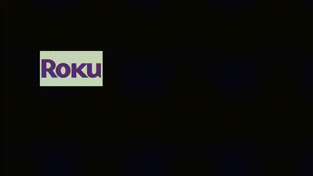

# Roku Draw2d DVD Screensaver Example

> This project was created using [`npx create-roku-app`](https://github.com/haystacknews/create-roku-app)

This is an example project to mimic the the classic DVD player screensaver.

## Roku Screensavers

Roku screensavers need to meet a number of specialized requirements. Please read this documentation about Roku screensavers:

https://developer.roku.com/en-ca/docs/developer-program/media-playback/screensavers.md

## This Screensaver

This screensaver simply bounces an image around on the screen, that changes color when the image bounces.

If you are editing the code, you can change the image, the speed and if the image changes color.

## Before you start

1. Install the project dependencies (`npm install`) if you haven't done that yet.

1. Open the `bsconfig.json` file and enter the password for your Roku device.

1. Optionally you can hardcode your Roku device's IP in the `host` field. If you do so make sure to remove the `host` entry from the `.vscode/launch.json` settings.

## Launching your app

> This project assumes that you will be using VSCode as your code editor.

1. Go to the `Run and Debug` panel.

1. Select the option `Launch (dev)`

## NPM Commands available

- `build`: Builds your project with [`brighterscript`](https://github.com/rokucommunity/brighterscript). Includes source maps.

- `build:prod`: Builds your project without source maps.

- `lint`: Lints your source files with [`@rokucommunity/bslint`](https://github.com/rokucommunity/bslint)

- `lint:fix`: Lints your source files and applies automatic fixes.
